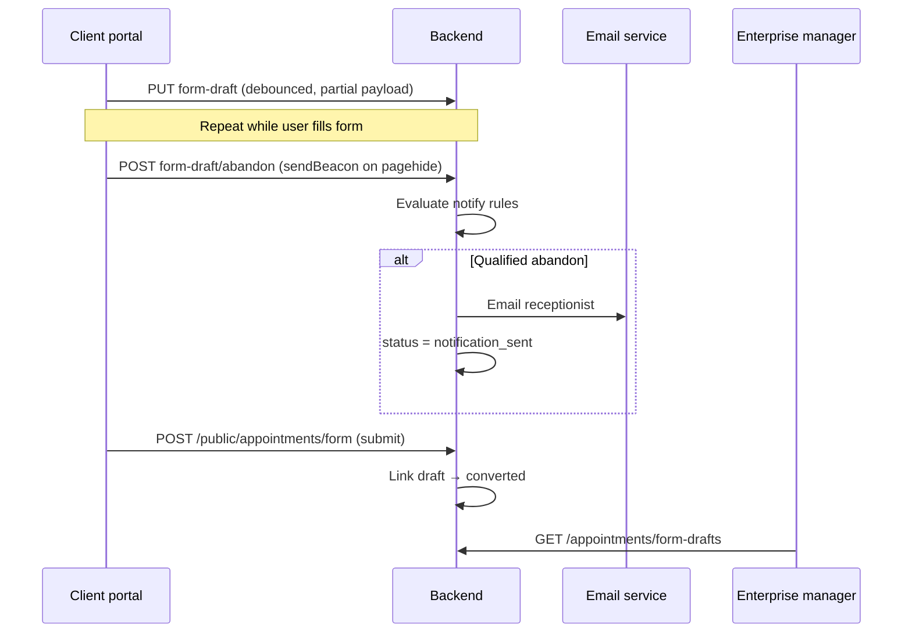

# Appointment request form — draft & abandon API contract

**Purpose:** Persist in-progress appointment request data, detect abandonment, email reception when appropriate, and expose drafts to staff for follow-up.

**Aligns with:** `AppointmentRequestForm.tsx` (`formSessionId`, GA4 `appointment_form_*` events), `POST /public/appointments/form`, `GET /appointments/request-submissions`.

**Consumers:** Public client portal (anonymous + logged-in JWT), enterprise manager (staff JWT), backend jobs (email).

---

## Overview



| Concern | Approach |
|--------|----------|
| Identity | Client-generated `formSessionId` (UUID); optional `draftId` after first save |
| Auth (public) | No JWT required; rate-limit by IP + session |
| Auth (staff) | Same JWT as `GET /appointments/request-submissions` |
| PII | Stored server-side only; not sent to GA4 |
| Email trigger | Server-side only after abandon + qualification rules |
| Tab close | `navigator.sendBeacon` to abandon endpoint |

---

## Public endpoints (no auth)

Base path: **`/public/appointments/form-drafts`**

All public routes accept optional header **`X-Form-Session-Id`** (duplicate of body `formSessionId`) for logging; body wins on conflict.

### 1. Upsert draft

**`PUT /public/appointments/form-drafts`**

Creates or updates a draft keyed by **`practiceId` + `formSessionId`**. Idempotent: same session always updates the same row.

#### Request body

| Field | Type | Required | Notes |
|-------|------|----------|-------|
| `formSessionId` | string (UUID) | yes | From `createAppointmentFormSessionId()` in UI |
| `practiceId` | number | yes | Default `1` in UI today |
| `currentStep` | string | yes | Page id, e.g. `new-client`, `request-visit-continued` |
| `currentStepName` | string | no | Human label; mirrors `getAppointmentFormStepName()` |
| `clientType` | `'new' \| 'existing'` | yes | Derived: logged-in or `haveUsedServicesBefore === 'Yes'` |
| `isLoggedIn` | boolean | yes | |
| `userId` | number | no | When JWT present |
| `lastActivityAt` | string (ISO 8601) | no | Client clock; server should set `updatedAt` authoritatively |
| `draftData` | object | yes | Partial form snapshot (schema below) |
| `analyticsContext` | object | no | Optional mirror of GA params (no PII beyond draft) |

#### `draftData` (partial snapshot)

Use the **same field names** as `POST /public/appointments/form` where possible so staff UI and conversion share one shape. All fields optional; include only what the user has entered.

**Minimum for “contact captured” (server validation):**

- `email` — valid format, **or**
- `phoneNumber` / `phoneNumbers` — non-empty after trim

**Recommended slices to save by step:**

| Step reached | Include in `draftData` |
|--------------|------------------------|
| `intro` | `email`, `fullName`, `haveUsedServicesBefore` |
| `new-client` | above + `phoneNumbers`, `physicalAddress`, `canWeText`, … |
| `new-client-pet-info` | above + `newClientPets`, `petSpecificData`, `howSoon` |
| `existing-client` / `existing-client-pets` | `email`, `fullName`, `bestPhoneNumber`, `selectedPetIds`, pets summary |
| `request-visit-continued` / euthanasia steps | scheduling fields, `serviceArea` / `serviceAreaVisit`, slot prefs |

Example (trimmed):

```json
{
  "formSessionId": "550e8400-e29b-41d4-a716-446655440000",
  "practiceId": 1,
  "currentStep": "new-client-pet-info",
  "currentStepName": "Pet Information",
  "clientType": "new",
  "isLoggedIn": false,
  "draftData": {
    "email": "client@example.com",
    "fullName": { "first": "Jane", "last": "Doe" },
    "phoneNumber": "2075550100",
    "physicalAddress": {
      "line1": "1 Main St",
      "city": "Portland",
      "state": "ME",
      "zip": "04101",
      "country": "US"
    },
    "newClientPets": [{ "id": "pet-1", "name": "Buddy", "species": "Dog" }],
    "howSoon": "Soon – sometime this week"
  }
}
```

#### Response `200 OK`

```json
{
  "draftId": 12345,
  "formSessionId": "550e8400-e29b-41d4-a716-446655440000",
  "status": "in_progress",
  "contactCaptured": true,
  "notifyEligible": false,
  "updatedAt": "2026-05-22T18:30:00.000Z"
}
```

| Field | Meaning |
|-------|---------|
| `contactCaptured` | Server computed: email or phone present |
| `notifyEligible` | Would qualify for email **if** abandoned now (see rules) |

#### Errors

| Status | Body | When |
|--------|------|------|
| `400` | `{ "message": "..." }` | Missing `formSessionId`, invalid `practiceId` |
| `429` | `{ "message": "Too many requests" }` | Rate limit |

---

### 2. Report abandon

**`POST /public/appointments/form-drafts/abandon`**

Called on tab close (`pagehide`), confirmed browser back, exit to portal, etc. Must be **fast** and **`sendBeacon`-safe** (no custom auth headers required).

#### Request

Prefer **`Content-Type: application/json`**; also accept `text/plain` body that is a JSON string (beacon limitation workaround).

| Field | Type | Required | Notes |
|-------|------|----------|-------|
| `formSessionId` | string | yes | |
| `practiceId` | number | yes | |
| `abandonReason` | string | yes | See enum below |
| `currentStep` | string | yes | Step at leave time |
| `currentStepName` | string | no | |
| `clientType` | `'new' \| 'existing'` | yes | |
| `isLoggedIn` | boolean | yes | |
| `draftData` | object | no | Final snapshot; if omitted, server uses last PUT |

#### `abandonReason` enum

| Value | UI source |
|-------|-----------|
| `page_hide` | `pagehide` event |
| `component_unmount` | React cleanup (SPA navigation away) |
| `browser_back` | Confirmed popstate back |
| `exit_to_portal` | User confirmed leave to portal |
| `idle_timeout` | No form activity for N minutes (default 15; `VITE_APPOINTMENT_FORM_ABANDON_IDLE_MINUTES`) |
| `zone_not_serviced` | Optional: left after zone block |

#### Response `200 OK`

```json
{
  "draftId": 12345,
  "status": "abandoned",
  "notificationSent": true,
  "notificationSkippedReason": null
}
```

When notification is **not** sent:

```json
{
  "draftId": 12345,
  "status": "abandoned",
  "notificationSent": false,
  "notificationSkippedReason": "no_contact_info"
}
```

#### `notificationSkippedReason` enum

| Value | Meaning |
|-------|---------|
| `no_contact_info` | No valid email or phone |
| `step_too_early` | e.g. still on `intro` only |
| `already_converted` | User submitted full form |
| `already_notified` | Deduped for this draft |
| `cooldown` | Same email notified within cooldown window |
| `logged_out_existing_prompt` | Optional: existing client told to log in, no contact |
| `disabled` | Feature flag off |

**Idempotent:** Repeating abandon for the same `formSessionId` returns `200` with `notificationSent: false` and `notificationSkippedReason: 'already_notified'` (no second email).

---

### 3. Mark converted (optional explicit)

**`POST /public/appointments/form-drafts/converted`**

Normally the backend links the draft when handling **`POST /public/appointments/form`** (match on `formSessionId` in submission metadata — see below). This endpoint is optional if the client sends an explicit conversion after submit success.

#### Request

```json
{
  "formSessionId": "550e8400-e29b-41d4-a716-446655440000",
  "practiceId": 1,
  "submissionId": 9876
}
```

#### Response `200 OK`

```json
{
  "draftId": 12345,
  "status": "converted",
  "submissionId": 9876
}
```

---

### Submit integration (existing endpoint)

**`POST /public/appointments/form`** — add optional metadata (non-breaking):

```json
{
  "formSessionId": "550e8400-e29b-41d4-a716-446655440000",
  "...": "existing submission fields unchanged"
}
```

**Backend on successful submit:**

1. Persist submission (existing behavior).
2. Upsert draft → `status: converted`, `submissionId`, `convertedAt`.
3. Do **not** send abandon email.

---

## Notification rules (server)

Email reception **only when all** are true:

| # | Rule |
|---|------|
| 1 | `status` was `in_progress` (or `abandoned` not yet notified) |
| 2 | `contactCaptured === true` |
| 3 | `currentStep` **not** in `intro`, `success` |
| 4 | `draftData` has meaningful progress: at least one of — phone, address line1, pet name, `selectedPetIds.length > 0`, `newClientPets.length > 0`, scheduling field |
| 5 | No `converted` draft for same `formSessionId` |
| 6 | Dedupe: no `notification_sent` for same `formSessionId` in last **24 hours** (configurable) |
| 7 | Optional cooldown: same normalized `email` max **1** abandon email per **24h** across sessions |

### Receptionist recipient

Resolve in order:

1. **Service area** on draft → practice mapping table (Portland vs High Peaks), same concept as form `serviceArea` / `serviceAreaVisit`
2. Else **primary provider** on draft / client record if resolvable
3. Else practice **`defaultReceptionistEmail`** (env or practice settings)

Align with `receptionistEmail` on `GET /notifications/overdue-reminders` where possible.

### Email content (suggested)

**Subject:** `Incomplete appointment request – {clientDisplayName}`

**Body fields:**

- Client name, email, phone, can text
- Client type (new / existing), logged in Y/N
- Step abandoned (`currentStepName`)
- Service area, how soon, appointment type / euthanasia flag
- Pet names (summary)
- Address (city/state/zip minimum)
- Link: `{ENTERPRISE_MANAGER_URL}/tools/appointment-drafts/{draftId}` (staff route TBD)
- `formSessionId` for support lookup

**Do not** include full SSN-level data; match what reception already sees on submissions.

---

## Staff endpoints (JWT required)

Base path: **`/appointments/form-drafts`**

Same auth/roles as **`GET /appointments/request-submissions`**.

### 4. List drafts

**`GET /appointments/form-drafts`**

#### Query params

| Param | Type | Default | Notes |
|-------|------|---------|-------|
| `practiceId` | number | required | |
| `from` | date `YYYY-MM-DD` | optional | Filter `updatedAt` or `abandonedAt` |
| `to` | date | optional | |
| `status` | string | optional | Comma-separated: `in_progress,abandoned,converted,notification_sent,dismissed` |
| `contactCaptured` | boolean | optional | |
| `page` | number | `1` | |
| `limit` | number | `50` | max `200` |

#### Response `200 OK`

```json
{
  "items": [
    {
      "id": 12345,
      "practiceId": 1,
      "formSessionId": "550e8400-e29b-41d4-a716-446655440000",
      "status": "abandoned",
      "clientType": "new",
      "isLoggedIn": false,
      "currentStep": "request-visit-continued",
      "currentStepName": "Appointment Time Selection",
      "contactEmail": "client@example.com",
      "contactPhone": "2075550100",
      "clientDisplayName": "Jane Doe",
      "serviceArea": "Kennebunk / Greater Portland / Augusta Area",
      "appointmentTypeSummary": "Wellness Exam",
      "petSummary": "Buddy (Dog)",
      "abandonReason": "page_hide",
      "abandonedAt": "2026-05-22T18:35:00.000Z",
      "notificationSentAt": "2026-05-22T18:35:01.000Z",
      "receptionistEmail": "reception@example.com",
      "submissionId": null,
      "followUpStatus": "pending",
      "createdAt": "2026-05-22T18:20:00.000Z",
      "updatedAt": "2026-05-22T18:35:00.000Z"
    }
  ],
  "total": 42,
  "limit": 50,
  "offset": 0
}
```

List rows are **summary** fields; full `draftData` only on detail GET.

---

### 5. Get draft detail

**`GET /appointments/form-drafts/:id`**

#### Response `200 OK`

```json
{
  "id": 12345,
  "practiceId": 1,
  "formSessionId": "550e8400-e29b-41d4-a716-446655440000",
  "status": "abandoned",
  "clientType": "new",
  "isLoggedIn": false,
  "currentStep": "request-visit-continued",
  "currentStepName": "Appointment Time Selection",
  "abandonReason": "page_hide",
  "draftData": { },
  "submissionId": null,
  "notificationSentAt": "2026-05-22T18:35:01.000Z",
  "receptionistEmail": "reception@example.com",
  "followUpStatus": "pending",
  "followUpNotes": null,
  "followUpBy": null,
  "followUpAt": null,
  "clientIp": "203.0.113.1",
  "createdAt": "2026-05-22T18:20:00.000Z",
  "updatedAt": "2026-05-22T18:35:00.000Z",
  "abandonedAt": "2026-05-22T18:35:00.000Z",
  "convertedAt": null
}
```

---

### 6. Update follow-up status

**`PATCH /appointments/form-drafts/:id`**

#### Request

```json
{
  "followUpStatus": "contacted",
  "followUpNotes": "Left voicemail, will retry tomorrow"
}
```

#### `followUpStatus` enum

`pending` | `contacted` | `scheduled` | `not_interested` | `dismissed`

#### Response `200 OK`

Full draft object (same as GET).

---

## Persistence model (suggested)

Table: **`appointment_form_drafts`**

| Column | Type | Notes |
|--------|------|-------|
| `id` | bigint PK | `draftId` in API |
| `practice_id` | int | |
| `form_session_id` | uuid/string unique per practice | |
| `status` | enum | See below |
| `client_type` | enum | new / existing |
| `is_logged_in` | boolean | |
| `user_id` | int nullable | |
| `current_step` | varchar | |
| `current_step_name` | varchar nullable | |
| `draft_data` | jsonb | |
| `contact_email` | varchar nullable | Normalized, indexed |
| `contact_phone` | varchar nullable | |
| `client_display_name` | varchar nullable | Denormalized for list |
| `service_area` | varchar nullable | |
| `abandon_reason` | varchar nullable | |
| `abandoned_at` | timestamptz nullable | |
| `notification_sent_at` | timestamptz nullable | |
| `receptionist_email` | varchar nullable | |
| `submission_id` | bigint nullable FK | → request_submissions |
| `follow_up_status` | enum | default `pending` |
| `follow_up_notes` | text nullable | |
| `follow_up_by` | int nullable | employee user id |
| `follow_up_at` | timestamptz nullable | |
| `client_ip` | inet nullable | |
| `created_at` / `updated_at` | timestamptz | |

### `status` lifecycle

```
in_progress → abandoned → (notification_sent is a flag/timestamp, not required separate status)
in_progress → converted
abandoned → dismissed (staff)
```

Recommended enum: `in_progress` | `abandoned` | `converted` | `dismissed`

Store `notification_sent_at` instead of overloading `status`.

---

## Frontend integration checklist

| Event | Action |
|-------|--------|
| Form mount | Keep `formSessionIdRef`; include in submit payload |
| After contact fields valid | Debounced `PUT` every 3–5s and on step `completed` |
| `pagehide` / confirmed leave | `sendBeacon` abandon + last `draftData` |
| Submit success | `POST converted` or rely on `formSessionId` in submit body |
| GA4 | Keep existing events; no PII in GA |

### Debounce pseudocode

```ts
// Save when email valid OR phone non-empty OR step beyond intro
const shouldPersistDraft =
  contactCaptured(formData) || !['intro', 'success'].includes(currentPage);

// Abandon: mirror trackFormAbandoned reasons
```

### Beacon example

```ts
const payload = JSON.stringify({
  formSessionId,
  practiceId: 1,
  abandonReason: 'page_hide',
  currentStep: page,
  currentStepName: getAppointmentFormStepName(page),
  clientType,
  isLoggedIn,
  draftData: buildDraftSnapshot(formData),
});

navigator.sendBeacon(
  `${apiBaseUrl}/public/appointments/form-drafts/abandon`,
  new Blob([payload], { type: 'application/json' })
);
```

---

## Rate limiting & security

| Control | Suggestion |
|---------|------------|
| Public PUT | 60/min per IP, 30/min per `formSessionId` |
| Public abandon | 10/min per `formSessionId` |
| Payload size | Max 256 KB `draftData` |
| Logged-in PUT | Accept `Authorization`; bind `userId` |
| Staff GET | Practice-scoped; no cross-practice |
| Retention | Delete or archive drafts > 90 days (configurable) |

---

## Feature flag

**`APPOINTMENT_FORM_ABANDON_EMAIL_ENABLED`** (practice or global). When false, abandon still persists for internal reporting but `notificationSent` is always false with `notificationSkippedReason: 'disabled'`.

---

## Enterprise manager UI (follow-up, separate task)

- New API module: `src/api/appointmentFormDrafts.ts`
- Optional page under Tools / Analytics: list + detail + PATCH follow-up
- Optional env: `VITE_APPOINTMENT_FORM_DRAFTS_ENABLED`

---

## Open questions for product

1. **Existing client without login:** Notify when email matches PIMS but they did not log in?
3. **Euthanasia path:** Higher priority recipient or subject line?
4. **Cooldown:** 24h per email vs per session only?

---

## Versioning

- **v1:** Endpoints above.
- Submit body `formSessionId` optional until frontend deployed; backend creates orphan submissions without draft link until then.
