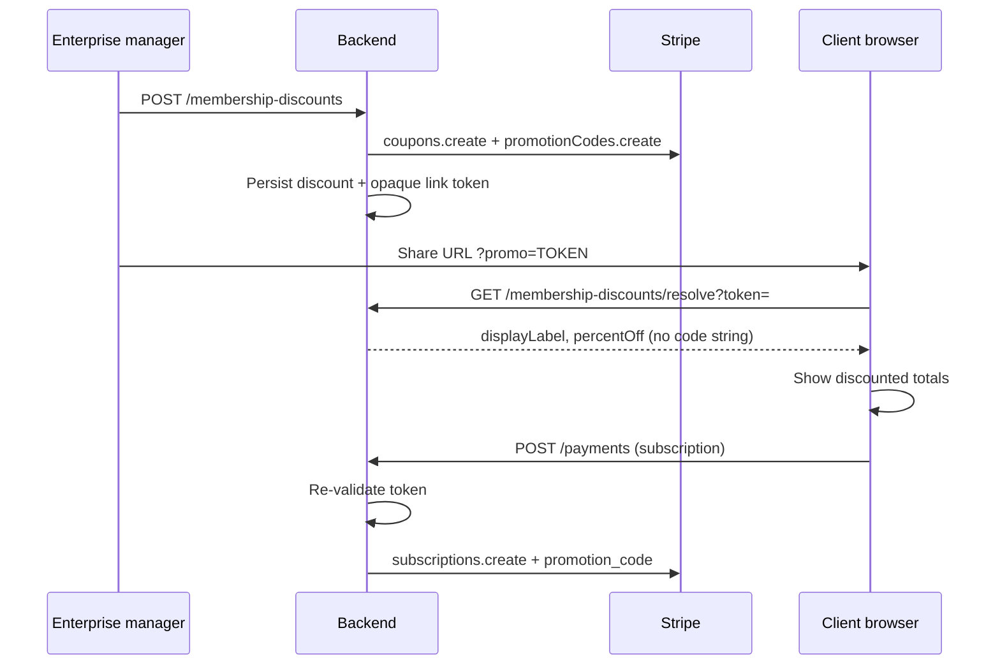

# Stripe membership promotion links — API contract

**Purpose:** Let staff create Stripe subscription discounts and share **opaque links** so clients enroll in membership with the discount applied automatically. Clients never type or see a promo code.

**Scope:** Stripe only. Square checkout is unchanged.

**Aligns with:** `src/api/payments.ts`, `src/pages/MembershipPromotions.tsx` (Admin → **Promotions** at `/admin/membership-promotions`), `src/pages/MembershipSignup.tsx`, `src/pages/MembershipPayment.tsx`, `src/utils/membershipStripeDiscount.ts`.

**Frontend env:** `VITE_PAYMENT_PROVIDER=stripe` (routes use `/stripe/payment-processing/…`).

---

## Overview



| Concern | Approach |
|--------|----------|
| Promo code visibility | Never return Stripe `code` string to the browser; use opaque `token` in URLs |
| Stripe object used at checkout | `promotion_code` id (`promo_…`) on subscription create |
| Public signup | `resolve` must work **without** JWT (appointment form, room loader, logged-out portal) |
| Admin CRUD | Admin / superadmin JWT (Admin → Promotions) |
| Amount on payment POST | Frontend sends discounted `amount` in cents for display; **Stripe invoice is source of truth** — do not double-apply |

---

## Base path

All routes below are under:

```http
/stripe/payment-processing
```

Same prefix as existing Stripe membership endpoints (`subscription-plan-catalog`, `payments`, etc.).

---

## Endpoints

### 1. List discounts (staff)

**`GET /stripe/payment-processing/membership-discounts`**

**Auth:** Admin / superadmin JWT (Admin → Promotions tab).

**Response:** JSON array, or envelope `{ items: [...] }` or `{ discounts: [...] }` (frontend accepts any of these).

#### Response item: `MembershipDiscountRecord`

| Field | Type | Required | Notes |
|-------|------|----------|-------|
| `id` | string (UUID) | yes | Internal id |
| `name` | string | yes | Staff-only label |
| `displayLabel` | string | yes | Shown on signup/payment (e.g. "20% off your membership") |
| `percentOff` | number | one of | 1–100; mutually exclusive with `amountOffCents` |
| `amountOffCents` | number | one of | Fixed discount in cents (USD) |
| `duration` | `"once"` \| `"repeating"` \| `"forever"` | yes | Maps to Stripe coupon `duration`. Admin UI **First month off** sends `once`. |
| `maxRedemptions` | number \| null | no | Global cap on promotion code redemptions |
| `timesRedeemed` | number | no | For admin table |
| `expiresAt` | string (ISO 8601) \| null | no | Promotion / coupon expiry |
| `active` | boolean | yes | If false, resolve should fail |
| `createdAt` | string (ISO 8601) | no | |
| `linkToken` | string \| null | no | Latest shareable opaque token, if a link exists |

#### Example

```json
[
  {
    "id": "a1b2c3d4-e5f6-7890-abcd-ef1234567890",
    "name": "VIP client — 20% off",
    "displayLabel": "20% off your membership",
    "percentOff": 20,
    "duration": "forever",
    "maxRedemptions": 50,
    "timesRedeemed": 3,
    "expiresAt": "2026-12-31T23:59:59.000Z",
    "active": true,
    "linkToken": "k7Hx9mP2qR4sT6vW8yZ0aB1cD3eF5gH"
  }
]
```

---

### 2. Create discount (staff)

**`POST /stripe/payment-processing/membership-discounts`**

**Auth:** Admin / superadmin JWT.

#### Request body: `CreateMembershipDiscountRequest`

| Field | Type | Required | Notes |
|-------|------|----------|-------|
| `name` | string | yes | Internal name |
| `displayLabel` | string | no | Defaults from `name` or generated label |
| `percentOff` | number | one of | 1–100 |
| `amountOffCents` | number | one of | USD cents |
| `duration` | `"once"` \| `"repeating"` \| `"forever"` | yes | |
| `durationInMonths` | number | if `repeating` | Stripe `duration_in_months` |
| `maxRedemptions` | number | no | Stripe promotion code limit |
| `expiresAt` | string (date or ISO) | no | Coupon / promotion `redeem_by` or `expires_at` |
| `createLink` | boolean | no | If `true`, also create first opaque link and return `linkToken` |

**Admin UI — discount types:** **Percent off** and **Fixed amount off** use `duration` `forever` or `repeating`. **First month off** always sends `duration: "once"` with either `percentOff` (default 100% = free first month) or `amountOffCents` for a dollar amount off the first invoice.

#### Backend behavior

1. Create Stripe **Coupon** (`stripe.coupons.create`).
2. Create Stripe **Promotion Code** (`stripe.promotionCodes.create`) linked to that coupon.
   - You may set an internal/random `code` in Stripe; it is **not** exposed to the frontend.
3. Persist mapping: internal `id` → `stripeCouponId`, `stripePromotionCodeId`.
4. If `createLink: true`, generate cryptographically random **opaque** `token` (URL-safe, ≥ 32 chars), store in link table.

#### Response

Single `MembershipDiscountRecord` (201), including `linkToken` when `createLink` was true.

#### Example request

```json
{
  "name": "VIP client — 20% off",
  "displayLabel": "20% off your membership",
  "percentOff": 20,
  "duration": "forever",
  "maxRedemptions": 50,
  "expiresAt": "2026-12-31",
  "createLink": true
}
```

#### Stripe mapping

| Request | Stripe Coupon |
|---------|----------------|
| `percentOff` | `percent_off` |
| `amountOffCents` | `amount_off` + `currency: "usd"` |
| `duration: "once"` | `duration: "once"` |
| `duration: "forever"` | `duration: "forever"` |
| `duration: "repeating"` | `duration: "repeating"`, `duration_in_months` |
| `maxRedemptions` | coupon and/or promotion code `max_redemptions` |
| `expiresAt` | `redeem_by` (unix) or promotion `expires_at` |

**Recommendation:** Restrict coupon to membership **products/prices** via Stripe `applies_to.products` so discounts cannot be used on unrelated line items.

---

### 3. Create share link (staff)

**`POST /stripe/payment-processing/membership-discounts/links`**

**Auth:** Admin / superadmin JWT.

#### Request body

| Field | Type | Required | Notes |
|-------|------|----------|-------|
| `discountId` | string (UUID) | yes | Internal discount id |
| `linkExpiresAt` | string (ISO / date) | no | Optional per-link expiry |

#### Response: `CreateMembershipDiscountLinkResponse`

| Field | Type | Required | Notes |
|-------|------|----------|-------|
| `token` | string | yes | Opaque token for `?promo=` query param |
| `url` | string | no | Optional full URL; frontend builds URL if omitted |

#### Example

```json
// Request
{ "discountId": "a1b2c3d4-e5f6-7890-abcd-ef1234567890" }

// Response
{
  "token": "k7Hx9mP2qR4sT6vW8yZ0aB1cD3eF5gH"
}
```

Frontend builds client URLs as:

```text
{origin}/client-portal/membership-signup?promo={token}
{origin}/client-portal/request-appointment/membership-signup?promo={token}
```

Query param name is fixed: **`promo`** (`MEMBERSHIP_PROMO_QUERY_PARAM` in frontend).

**Pet selection:** Promo links open `/client-portal/membership-signup?promo=…` without navigation state. Logged-in clients see a **Choose a pet** step (all pets on the account). One pet is auto-selected. Optional deep link: `&petId={pimsId}` to skip the picker when staff know the pet.

**Not logged in:** `/client-portal/membership-signup` requires a client portal account. Unauthenticated users are sent to **Login**; after a successful client login they are returned to the same path and query string (including `?promo=`). Login shows a short note that enrollment will continue after sign-in. Users without a portal account should use **Create client account** or the appointment request form first.

---

### 4. Resolve link (checkout — public)

**`GET /stripe/payment-processing/membership-discounts/resolve?token={token}`**

**Auth:** **None required** (public). Rate-limit by IP. Optional: allow JWT for audit only.

Called when the client opens a signup URL with `?promo=`.

#### Response: `ResolveMembershipDiscountResponse`

| Field | Type | Required | Notes |
|-------|------|----------|-------|
| `valid` | boolean | yes | |
| `discount` | object | if valid | See below |
| `message` | string | if invalid | User-facing, e.g. "This offer has expired" |

#### `discount` when valid: `MembershipCheckoutDiscount`

| Field | Type | Required | Notes |
|-------|------|----------|-------|
| `token` | string | yes | Same as query param (echo) |
| `stripePromotionCodeId` | string | yes | `promo_…` — used server-side on payment; frontend passes back on POST |
| `displayLabel` | string | yes | Shown in UI |
| `percentOff` | number | no | For UI price preview |
| `amountOffCents` | number | no | For UI price preview |
| `duration` | string | no | Optional, for support tooling |

**Do not include:** Stripe promotion `code` string, coupon id (unless needed server-side only).

#### Validation rules

Fail with `valid: false` when:

- Token unknown, revoked, or link expired
- Parent discount `active === false`
- Stripe promotion code inactive, expired, or at `max_redemptions`
- (Optional future) token bound to specific `clientId` / email and requester does not match

#### Example — valid

```json
{
  "valid": true,
  "discount": {
    "token": "k7Hx9mP2qR4sT6vW8yZ0aB1cD3eF5gH",
    "stripePromotionCodeId": "promo_1ABCdefghiJKL",
    "displayLabel": "20% off your membership",
    "percentOff": 20,
    "duration": "forever"
  }
}
```

#### Example — invalid

```json
{
  "valid": false,
  "message": "This offer link is not valid or has expired."
}
```

**HTTP status:** `200` with `valid: false` is fine (frontend handles message). Alternatively `404` with body above.

---

### 5. Create payment / subscription (existing — extended)

**`POST /stripe/payment-processing/payments`**

**Auth:** As today for membership checkout (client JWT and/or public flows per your existing rules).

#### New optional fields on existing `PaymentRequest`

| Field | Type | Required | Notes |
|-------|------|----------|-------|
| `membershipDiscountToken` | string | no | Opaque `?promo=` token |
| `stripePromotionCodeId` | string | no | `promo_…`; frontend sends both when available |

Frontend only sends these when `VITE_PAYMENT_PROVIDER=stripe` and user arrived via promo link (or discount carried in navigation state).

#### Example fragment (subscription enrollment)

```json
{
  "provider": "stripe",
  "sourceId": "pm_1ExamplePaymentMethod",
  "idempotencyKey": "550e8400-e29b-41d4-a716-446655440000",
  "amount": 7920,
  "currency": "USD",
  "intent": "SUBSCRIPTION",
  "subscriptionPlanId": "prod_xxx",
  "subscriptionPlanVariationId": "price_xxx",
  "customerEmail": "client@example.com",
  "customerName": "Jane Doe",
  "membershipDiscountToken": "k7Hx9mP2qR4sT6vW8yZ0aB1cD3eF5gH",
  "stripePromotionCodeId": "promo_1ABCdefghiJKL",
  "membershipTransaction": { }
}
```

#### Required backend behavior on subscription create

1. **Re-resolve** `membershipDiscountToken` (do not trust `stripePromotionCodeId` alone).
2. Confirm promotion still valid (same rules as `resolve`).
3. Create Stripe subscription with promotion applied, e.g.:

```ts
await stripe.subscriptions.create({
  customer: stripeCustomerId,
  items: [{ price: subscriptionPlanVariationId }],
  default_payment_method: paymentMethodIdFromSourceId,
  promotion_code: stripePromotionCodeId,
  // ...existing metadata, trial, etc.
});
```

4. Record redemption (increment `timesRedeemed`, audit log: token, client, patient, subscription id).
5. Return existing `PaymentResponse` shape (`success`, `providerResponse`, etc.).

**Important:** Apply discount **only** via Stripe `promotion_code` on the subscription. The frontend `amount` is an estimate for receipts/UI; avoid applying a second manual discount to the same charge.

---

## Suggested persistence

### Table: `membership_discount`

| Column | Type | Notes |
|--------|------|-------|
| `id` | UUID PK | |
| `name` | text | |
| `display_label` | text | |
| `stripe_coupon_id` | text | `coupon_…` |
| `stripe_promotion_code_id` | text | `promo_…` |
| `percent_off` | int nullable | |
| `amount_off_cents` | int nullable | |
| `duration` | enum | once / repeating / forever |
| `duration_in_months` | int nullable | |
| `max_redemptions` | int nullable | |
| `times_redeemed` | int default 0 | |
| `expires_at` | timestamptz nullable | |
| `active` | boolean | |
| `created_at` | timestamptz | |

### Table: `membership_discount_link`

| Column | Type | Notes |
|--------|------|-------|
| `id` | UUID PK | |
| `discount_id` | UUID FK | |
| `token` | text unique | Opaque, indexed |
| `expires_at` | timestamptz nullable | Per-link expiry |
| `revoked_at` | timestamptz nullable | |
| `created_at` | timestamptz | |

---

## Error handling

| Situation | Suggested response |
|-----------|-------------------|
| Admin list/create without Stripe configured | `503` or `404` with clear message |
| Invalid create body (both percent and amount) | `400` |
| Unknown `discountId` on link create | `404` |
| Invalid resolve token | `200` + `{ valid: false, message }` or `404` |
| Payment with invalid/expired token | `400` / `402` with message client can show |
| Stripe API failure | `502` with safe message; log Stripe error server-side |

Frontend admin panel treats **`404`** on list as “API not deployed yet”.

---

## Security checklist

- [ ] `resolve` is public but rate-limited
- [ ] Never expose Stripe `code` in API responses
- [ ] Re-validate token on every `POST /payments` subscription
- [ ] Idempotency on payment POST unchanged (`idempotencyKey`)
- [ ] Optional: per-link or per-discount `client_id` / email allowlist
- [ ] Optional: restrict coupon to membership product IDs in Stripe
- [ ] Staff routes require admin / superadmin (Admin → Promotions)

---

## Environment

| Layer | Variable |
|-------|----------|
| Frontend | `VITE_PAYMENT_PROVIDER=stripe`, `VITE_STRIPE_PUBLISHABLE_KEY=pk_…` |
| Backend | Stripe secret key; `PAYMENT_PROVIDER=stripe` (or equivalent) |

---

## Implementation checklist (backend)

- [ ] `GET /stripe/payment-processing/membership-discounts`
- [ ] `POST /stripe/payment-processing/membership-discounts`
- [ ] `POST /stripe/payment-processing/membership-discounts/links`
- [ ] `GET /stripe/payment-processing/membership-discounts/resolve?token=`
- [ ] Extend `POST /stripe/payment-processing/payments` for `membershipDiscountToken` + subscription `promotion_code`
- [ ] Public access + rate limit on `resolve`
- [ ] Stripe Coupon + Promotion Code creation on admin create
- [ ] Redemption tracking and audit log

---

## Frontend reference (for API owners)

| Behavior | Location |
|----------|----------|
| API client functions | `src/api/payments.ts` |
| Admin UI | `src/pages/MembershipPromotions.tsx` → `/admin/membership-promotions` |
| Resolve on signup | `src/pages/MembershipSignup.tsx` (`?promo=`) |
| Payment POST fields | `src/pages/MembershipPayment.tsx` |
| Price preview math | `src/utils/membershipStripeDiscount.ts` |

Types in `src/api/payments.ts` are the source of truth for field names sent and expected in responses.
