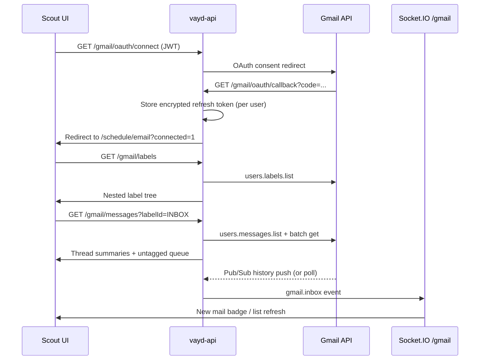

# Scout Gmail inbox — backend API contract

**Purpose:** Shared Gmail inbox inside Scout (`/schedule/email`). Staff read, compose, label, and manage email without leaving the PIMS. One shared Workspace inbox; per-user OAuth tokens (not a service account).

**Aligns with:** `ScheduleLayout` rail, Socket.IO pattern in `src/utils/calendarRealtime.ts`, integration style of `src/api/clientSms.ts`.

**Consumers:** Enterprise manager (staff JWT), Google OAuth callback (browser redirect).

**Backend repo:** `vayd-api` — implement under `src/gmail/`.

---

## Overview



| Concern | Approach |
|--------|----------|
| Inbox | Single shared mailbox (`GMAIL_SHARED_MAILBOX` env) |
| Auth (Scout) | Existing staff JWT (`AuthGuard`) |
| Auth (Gmail) | OAuth2 per user; encrypted refresh tokens in Postgres |
| Labels | Pass-through from Gmail API; preserve nesting + colors |
| Untagged queue | Messages in INBOX with **no user labels** (system labels only) |
| Realtime | Socket.IO namespace `/gmail`, room `practice:{practiceId}` |
| History sync | Gmail `history.list` from stored `historyId`; Pub/Sub preferred |

### Out of scope (v1)

Patient record linking, Drive, Chat, custom action buttons beyond label management.

---

## Google Cloud setup (one-time, ~10 min)

Workspace admin (Deirdre) completes once:

1. Create/select GCP project → **APIs & Services → Enable Gmail API**.
2. **OAuth consent screen** — Internal (Workspace) or External if needed; add scopes:
   - `https://www.googleapis.com/auth/gmail.readonly`
   - `https://www.googleapis.com/auth/gmail.compose`
   - `https://www.googleapis.com/auth/gmail.modify`
3. **Credentials → OAuth 2.0 Client ID** — Web application.
   - Authorized redirect URI: `{API_ORIGIN}/gmail/oauth/callback` (e.g. `http://localhost:3000/gmail/oauth/callback`).
4. (Recommended) **Cloud Pub/Sub** topic + push subscription for Gmail `users.watch` push notifications.
5. Copy **Client ID** and **Client secret** into API env.

Staff each complete OAuth once via Scout Settings or first visit to `/schedule/email`.

---

## Environment variables

Add to `vayd-api` `.env.example`:

| Variable | Required | Notes |
|----------|----------|-------|
| `GMAIL_OAUTH_CLIENT_ID` | yes | OAuth web client ID |
| `GMAIL_OAUTH_CLIENT_SECRET` | yes | OAuth web client secret |
| `GMAIL_OAUTH_REDIRECT_URI` | yes | Must match GCP console (API origin + `/gmail/oauth/callback`) |
| `GMAIL_SHARED_MAILBOX` | yes | Shared inbox email, e.g. `care@vayd.com` |
| `GMAIL_TOKEN_ENCRYPTION_KEY` | yes | 32-byte hex or base64 key for AES-256-GCM at rest |
| `GMAIL_OAUTH_SUCCESS_REDIRECT` | yes | Frontend URL after connect, e.g. `http://localhost:5173/schedule/email?connected=1` |
| `GMAIL_PUBSUB_TOPIC` | no | `projects/{project}/topics/{name}` for `users.watch` |
| `GMAIL_WATCH_LABEL_IDS` | no | Default `INBOX`; comma-separated label IDs to watch |
| `GMAIL_POLL_INTERVAL_MS` | no | Fallback poll when Pub/Sub absent (default `60000`) |

**Do not** expose client secret or encryption key to the frontend. Optional public env in Vite: `VITE_GMAIL_OAUTH_CLIENT_ID` only if using popup flow (redirect flow preferred).

---

## OAuth2 flow

### 1. Start connect

**`GET /gmail/oauth/connect`**

- **Auth:** staff JWT (`AuthGuard`).
- **Query:** optional `returnTo` (frontend path under `/schedule`, validated server-side).
- **Response `200`:** `{ "url": "https://accounts.google.com/o/oauth2/v2/auth?..." }`
- Frontend: `fetch` with Bearer token, then `window.location.assign(url)`.

### 2. Callback

**`GET /gmail/oauth/callback`**

- **Auth:** `@Public()` (Google redirect).
- **Query:** `code`, `state`, optional `error`.
- Validates `state`, exchanges `code` for tokens via Google token endpoint.
- Verifies token grants access to `GMAIL_SHARED_MAILBOX` (see **Shared mailbox access** below).
- Upserts row in `gmail_oauth_tokens` for `userId` (encrypted refresh token, `accessToken` + expiry, `grantedEmail`, `scopes`).
- Redirects to `GMAIL_OAUTH_SUCCESS_REDIRECT` or `returnTo` from state.

### 3. Connection status

**`GET /gmail/oauth/status`**

- **Auth:** staff JWT.
- **Response `200`:**

```json
{
  "connected": true,
  "grantedEmail": "staff@vayd.com",
  "connectedAt": "2026-06-24T12:00:00.000Z",
  "scopes": ["gmail.readonly", "gmail.compose", "gmail.modify"],
  "sharedMailbox": "care@vayd.com",
  "tokenExpiresAt": "2026-06-24T13:00:00.000Z"
}
```

When not connected: `{ "connected": false, "sharedMailbox": "care@vayd.com" }`.

### 4. Disconnect

**`DELETE /gmail/oauth/disconnect`**

- **Auth:** staff JWT.
- Revokes token at Google (best effort), deletes DB row.

### Shared mailbox access

Per-user OAuth (not service account). Each staff member authorizes individually. API calls use the **requesting user's token** when valid; if expired, refresh that user's token.

For a true shared inbox, staff should OAuth while signed into an account that can read the shared mailbox. Supported patterns:

1. **Shared login (recommended for v1):** Staff OAuth as the shared mailbox user (or delegated user). All tokens target the same `GMAIL_SHARED_MAILBOX` address.
2. **Delegate access:** Staff OAuth as themselves; Google grants access via Workspace delegation — backend still calls `users.messages` with `userId = GMAIL_SHARED_MAILBOX`.

Backend must set Gmail API `userId` path param to `GMAIL_SHARED_MAILBOX` for all mailbox operations. Store `grantedEmail` on the token row for audit.

---

## Database

### Table: `gmail_oauth_tokens`

| Column | Type | Notes |
|--------|------|-------|
| `id` | serial PK | |
| `user_id` | int FK → users | Unique per user |
| `granted_email` | varchar | Google account that consented |
| `refresh_token_enc` | text | AES-256-GCM encrypted |
| `access_token` | text nullable | Short-lived cache |
| `access_token_expires_at` | timestamptz nullable | |
| `scopes` | text[] | Granted scopes |
| `history_id` | varchar nullable | Last synced Gmail historyId for watch/poll |
| `watch_expiration` | timestamptz nullable | Gmail watch renewal |
| `created`, `updated` | timestamptz | Standard |

### Table: `gmail_send_as_aliases` (optional cache)

Populated from `users.settings.sendAs` on first connect or daily cron. Speeds compose alias picker.

| Column | Type | Notes |
|--------|------|-------|
| `id` | serial PK | |
| `practice_id` | int | |
| `send_as_email` | varchar | Alias address |
| `display_name` | varchar nullable | |
| `is_default` | boolean | |
| `is_primary` | boolean | |
| `treat_as_alias` | boolean | |

---

## REST API — labels

### List label tree

**`GET /gmail/labels`**

- **Auth:** staff JWT + valid Gmail connection (any connected user on practice; prefer caller's token).
- **Response `200`:**

```json
{
  "labels": [
    {
      "id": "INBOX",
      "name": "INBOX",
      "type": "system",
      "messageListVisibility": "show",
      "labelListVisibility": "labelShow",
      "messagesTotal": 120,
      "messagesUnread": 5,
      "threadsTotal": 98,
      "threadsUnread": 4,
      "color": null,
      "children": []
    },
    {
      "id": "Label_123",
      "name": "Triage",
      "type": "user",
      "messageListVisibility": "show",
      "labelListVisibility": "labelShow",
      "messagesTotal": 12,
      "messagesUnread": 2,
      "threadsTotal": 10,
      "threadsUnread": 2,
      "color": { "textColor": "#ffffff", "backgroundColor": "#16a765" },
      "children": [
        {
          "id": "Label_456",
          "name": "Triage/Urgent",
          "type": "user",
          "color": { "textColor": "#000000", "backgroundColor": "#fb4c2f" },
          "children": []
        }
      ]
    }
  ]
}
```

**Tree rules (backend):**

1. Fetch `users.labels.list` for `GMAIL_SHARED_MAILBOX`.
2. User labels use `/` in `name` for nesting (Gmail convention). Split on `/` and build tree; **do not flatten**.
3. Preserve `color`, counts, visibility fields from Gmail.
4. Include system labels needed by UI (`INBOX`, `SENT`, `DRAFT`, `STARRED`, `TRASH`, `SPAM`, `IMPORTANT`, `UNREAD`); omit internal system labels the UI does not need (`CATEGORY_*` optional in sidebar).
5. Sort: system labels first (fixed order), then user tree alphabetically by segment.

---

## REST API — messages / threads

### List messages (inbox or label)

**`GET /gmail/messages`**

| Query | Type | Default | Notes |
|-------|------|---------|-------|
| `labelId` | string | `INBOX` | Gmail label ID |
| `q` | string | — | Optional Gmail search query appended |
| `pageToken` | string | — | Gmail pagination |
| `maxResults` | number | `50` | 1–100 |

- **Response `200`:**

```json
{
  "labelId": "INBOX",
  "untaggedQueue": [
    {
      "id": "18f2abc123",
      "threadId": "18f2abc123",
      "snippet": "Hi, I need to reschedule...",
      "from": { "name": "Jane Doe", "email": "jane@example.com" },
      "to": [{ "email": "care@vayd.com" }],
      "subject": "Appointment question",
      "date": "2026-06-24T09:15:00.000Z",
      "isUnread": true,
      "isStarred": false,
      "labelIds": ["INBOX", "UNREAD"],
      "hasAttachments": false
    }
  ],
  "threads": [],
  "nextPageToken": "abc123",
  "resultSizeEstimate": 120
}
```

**Untagged queue (default INBOX view only):**

When `labelId=INBOX` and no custom `q`, backend returns two sections:

1. **`untaggedQueue`** — messages where `labelIds` contains only **system** labels (no `type=user` labels). These are “unclaimed” at the top of the inbox.
2. **`threads`** — remaining INBOX messages that have at least one user label, ordered by `internalDate` desc.

For non-INBOX labels, omit `untaggedQueue` (empty array) and return all messages in `threads`.

Implementation: list message IDs for label, batch `messages.get` with `format=metadata`, partition by user-label presence.

### Get thread (read view)

**`GET /gmail/threads/:threadId`**

- **Response `200`:**

```json
{
  "id": "18f2abc123",
  "historyId": "987654",
  "messages": [
    {
      "id": "18f2abc123",
      "threadId": "18f2abc123",
      "labelIds": ["INBOX", "Label_123"],
      "snippet": "...",
      "internalDate": "2026-06-24T09:15:00.000Z",
      "headers": {
        "from": "Jane Doe <jane@example.com>",
        "to": "care@vayd.com",
        "cc": "",
        "subject": "Appointment question",
        "messageId": "<abc@gmail.com>",
        "references": "",
        "inReplyTo": ""
      },
      "body": {
        "html": "<p>Hi...</p>",
        "text": "Hi..."
      },
      "attachments": [
        {
          "attachmentId": "ANGjdJ...",
          "filename": "photo.jpg",
          "mimeType": "image/jpeg",
          "size": 12345
        }
      ]
    }
  ]
}
```

- Use `threads.get` + `format=full` or per-message `messages.get`.
- Sanitize HTML server-side (strip scripts) before returning to frontend.
- **`GET /gmail/messages/:messageId/attachments/:attachmentId`** — stream attachment bytes (`users.messages.attachments.get`).

Side effect: opening a thread marks messages read unless `?markRead=false`.

---

## REST API — compose & reply

### Send / draft

**`POST /gmail/messages/send`**

```json
{
  "from": "dr.smith@vayd.com",
  "to": ["client@example.com"],
  "cc": [],
  "bcc": [],
  "subject": "Re: Your visit",
  "bodyHtml": "<p>Thank you...</p>",
  "bodyText": "Thank you...",
  "threadId": "18f2abc123",
  "inReplyTo": "<abc@gmail.com>",
  "references": "<abc@gmail.com>"
}
```

- Build RFC 2822 MIME; set `From` to chosen **send-as alias** (must exist in user's send-as list).
- **`threadId` + `inReplyTo` + `references`** required for reply/reply-all threading.
- **Response `200`:** `{ "id": "...", "threadId": "...", "labelIds": ["SENT"] }`

**`POST /gmail/drafts`** / **`PUT /gmail/drafts/:draftId`** — optional v1; same body shape.

### List send-as aliases

**`GET /gmail/send-as`**

```json
{
  "aliases": [
    {
      "sendAsEmail": "care@vayd.com",
      "displayName": "Vet At Your Door",
      "isDefault": true,
      "isPrimary": true,
      "treatAsAlias": false
    },
    {
      "sendAsEmail": "dr.smith@vayd.com",
      "displayName": "Dr. Smith",
      "isDefault": false,
      "isPrimary": false,
      "treatAsAlias": true
    }
  ]
}
```

Reply/reply-all: frontend pre-fills `from` based on thread context (last alias used or `To` matching alias list).

---

## REST API — label & mailbox actions

All mutations write through to Gmail immediately (`users.messages.modify`, `batchModify` where applicable).

**`POST /gmail/messages/:messageId/modify`**

```json
{
  "addLabelIds": ["Label_456"],
  "removeLabelIds": ["Label_123"]
}
```

**`POST /gmail/messages/batch-modify`**

```json
{
  "ids": ["18f2abc123", "18f2def456"],
  "addLabelIds": ["Label_789"],
  "removeLabelIds": []
}
```

**Convenience endpoints** (wrap modify):

| Method | Path | Gmail effect |
|--------|------|--------------|
| POST | `/gmail/messages/:id/archive` | remove `INBOX` |
| POST | `/gmail/messages/:id/trash` | add `TRASH`, remove `INBOX` |
| POST | `/gmail/messages/:id/star` | add/remove `STARRED` (toggle via body `{ "starred": true }`) |
| POST | `/gmail/messages/:id/read` | remove `UNREAD` |
| POST | `/gmail/messages/:id/unread` | add `UNREAD` |

**Response:** `{ "id": "...", "labelIds": [...] }`

After mutation, emit Socket.IO event (below).

---

## Realtime notifications

### Socket.IO namespace: `/gmail`

Mirror `/Users/brianoickle/Documents/source/vayd/vayd-api/src/appointments/appointment-realtime.gateway.ts`.

- **Auth:** JWT from handshake (same as `/calendar`).
- **Room:** `practice:{practiceId}` — join on connect + `gmail.joinPractice` / `gmail.leavePractice`.
- **Event:** `gmail.inbox`

```json
{
  "type": "history",
  "historyId": "987655",
  "mailboxEmail": "care@vayd.com",
  "addedMessageIds": ["18f2new001"],
  "affectedLabelIds": ["INBOX"],
  "unreadDelta": 1
}
```

Frontend (`src/utils/gmailRealtime.ts`): subscribe on `/schedule/email`, debounce list refresh, show badge count.

### Backend sync strategies

**Preferred — Gmail Pub/Sub watch:**

1. On first connect (or cron renewal), `users.watch` with `topicName=GMAIL_PUBSUB_TOPIC`.
2. Pub/Sub push → **`POST /webhooks/gmail/pubsub`** (`@Public()`, verify OIDC token from Google).
3. Load stored `historyId`, call `history.list`, diff message/label changes, broadcast `gmail.inbox`.
4. Renew watch before expiration (~7 days).

**Fallback — polling:**

- Cron every `GMAIL_POLL_INTERVAL_MS` when no Pub/Sub; same `history.list` diff logic.

---

## Error handling

| HTTP | When |
|------|------|
| 401 | Missing/invalid Scout JWT |
| 403 | User role cannot access Gmail (`employee`, `admin`, `superadmin` only) |
| 404 | Thread/message not found |
| 409 | `{ "code": "GMAIL_NOT_CONNECTED" }` — prompt OAuth |
| 409 | `{ "code": "GMAIL_TOKEN_REVOKED" }` — reconnect |
| 429 | Gmail rate limit — include `Retry-After` |
| 502 | Google API error — log, return safe message |

Frontend: on `GMAIL_NOT_CONNECTED`, show connect banner linking to `GET /gmail/oauth/connect`.

---

## Security

- Encrypt refresh tokens at rest (`GMAIL_TOKEN_ENCRYPTION_KEY`).
- Never log message bodies or tokens; audit log records `{ userId, action, messageId }` only.
- Validate `returnTo` on OAuth state (same-origin paths under `/schedule`).
- HTML body sanitization on read.
- Rate-limit OAuth connect endpoint (ThrottlerModule).
- Pub/Sub webhook: verify Google push JWT.

---

## Backend scaffold (vayd-api)

Initial module on branch `build-email-system`:

| File | Status |
|------|--------|
| `src/gmail/gmail.module.ts` | Registered in `app.module.ts` |
| `src/gmail/gmail-oauth.service.ts` | OAuth connect, callback, refresh, disconnect |
| `src/gmail/gmail-api.service.ts` | Label tree, message list, modify |
| `src/gmail/gmail.controller.ts` | REST routes (partial — see checklist) |
| `src/gmail/gmail-realtime.gateway.ts` | Socket.IO `/gmail` namespace |
| `src/migrations/1781900000000-create_gmail_oauth_tokens.ts` | Token storage |

**Still to implement on backend:** thread reader, compose/send, send-as aliases, batch-modify, Pub/Sub watch + webhook, HTML sanitization, attachment streaming.

## Implementation checklist (backend)
- [x] `googleapis` dependency + `GmailModule` registered in `app.module.ts`
- [x] Migration: `gmail_oauth_tokens`
- [x] `GmailOAuthService` — connect, callback, refresh, disconnect
- [x] `GmailApiService` — labels tree, messages list, modify (partial)
- [x] `GmailController` — REST routes (partial)
- [x] `GmailRealtimeGateway` — namespace `/gmail`
- [ ] `GmailWatchService` — watch + Pub/Sub or poll cron
- [ ] `GmailWebhookController` — `POST /webhooks/gmail/pubsub`
- [x] Config + `.env.example` entries
- [ ] Integration tests with Gmail API mocks
- [ ] Thread get, send, send-as, attachments

---

## Frontend integration (enterprise-manager)

### Route & nav

- Path: **`/schedule/email`**
- Add to `SCHEDULE_OUTLET_EXTRA_SEGMENTS` in `src/scout-tabs.ts`
- Rail link in `ScheduleLayout.tsx` (Mail icon)
- Lazy page: `src/pages/GmailInbox.tsx`

### API client

Create `src/api/gmail.ts`:

```typescript
// Thin wrappers around REST endpoints — no Google SDK in browser
export async function getGmailOAuthStatus() { ... }
export function getGmailOAuthConnectUrl() {
  return `${apiBaseUrl}/gmail/oauth/connect`; // window.location redirect with Bearer not possible; use window.open or link
}
export async function fetchGmailLabels() { ... }
export async function fetchGmailMessages(params) { ... }
export async function fetchGmailThread(threadId) { ... }
export async function sendGmailMessage(body) { ... }
export async function modifyGmailMessage(id, body) { ... }
```

OAuth connect: call `GET /gmail/oauth/connect` with Bearer token, then `window.location.assign(data.url)`.

### Realtime

`src/utils/gmailRealtime.ts` — copy `calendarRealtime.ts` pattern for namespace `/gmail`, event `gmail.inbox`.

### Suggested UI build order

1. OAuth status + connect banner
2. Label tree sidebar (`GmailLabelTree.tsx`)
3. Inbox list + untagged queue section
4. Thread reader panel
5. Compose / reply modals + send-as picker
6. Label apply/remove (context menu)
7. Archive, star, read/unread, trash
8. Realtime badge + auto-refresh

### UI layout (reference)

```
┌─────────────┬──────────────────────────┬─────────────────────┐
│ Label tree  │ Message list             │ Thread reader       │
│ (nested)    │ [Untagged queue]         │ (optional 3-col or  │
│             │ ─────────────────        │  master-detail)     │
│ ▼ INBOX     │ Tagged threads...        │                     │
│   Triage    │                          │                     │
│     Urgent  │                          │                     │
└─────────────┴──────────────────────────┴─────────────────────┘
```

---

## Related code (existing)

| Area | Path |
|------|------|
| Outbound SMTP fallback | `vayd-api/src/mailer/gmail-mail.service.ts` (separate from Gmail API inbox) |
| Calendar realtime pattern | `vayd-api/src/appointments/appointment-realtime.gateway.ts` |
| Frontend calendar socket | `src/utils/calendarRealtime.ts` |
| SMS integration pattern | `src/api/clientSms.ts` |

**Note:** `GmailMailService` (SMTP) is for transactional outbound mail (SES fallback). The Scout inbox uses **Gmail API OAuth** — different auth, different module. Do not merge.
